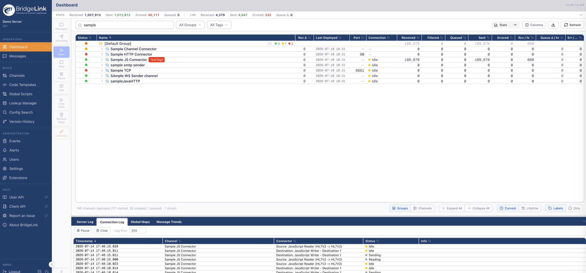

# BridgeLink

[](https://github.com/Innovar-Healthcare/BridgeLink/releases)
[](https://www.mozilla.org/en-US/MPL/2.0/)
[](https://hub.docker.com/r/innovarhealthcare/bridgelink)

BridgeLink® is the open source integration platform for healthcare, connecting the systems that speak HL7, FHIR, X12, XML, JSON, and more. BridgeLink began as a fork of Mirth® Connect 4.5.2, and since our first release in March 2025 our team at [Innovar Healthcare](https://www.innovarhealthcare.com) has modernized and hardened the platform, adding many brand new features such as:

- WebAdmin, our new web-based administrator client that replaces the 20-year-old Java client, no client install required
- Lookup Manager, built-in lookup table management for translating values as messages move between systems
- Version History, integrated Git version control so you never lose track of a channel change
- Message statistics and live channel monitoring dashboards

BridgeLink 26.x requires Java 17 or later.

Like an interpreter who translates foreign languages into the one you understand, BridgeLink translates message standards into the one your system understands. Whenever a "foreign" system sends you a message, BridgeLink's integration capabilities expedite the following:

- Filtering: BridgeLink reads message parameters and passes the message to or stops it on its way to the transformation stage.
- Transformation: BridgeLink converts the incoming message standard to another standard (e.g., HL7 to XML).
- Extraction: BridgeLink can "pull" data from and "push" data to a database.
- Routing: BridgeLink makes sure messages arrive at their assigned destinations.

Users manage and develop channels (message pathways) in the browser with BridgeLink WebAdmin.



## Useful Links

- [Website](https://www.bridgelink.net)
- [Downloads](https://www.bridgelink.net/download/)
- [Releases and changelog](https://github.com/Innovar-Healthcare/BridgeLink/releases)
- [WebAdmin repository](https://github.com/Innovar-Healthcare/BridgeLink-WebAdmin)
- [Docker images and Helm chart](https://github.com/Innovar-Healthcare/bridgelink-container)
- [WebAdmin Setup Guide (PDF)](https://innovar-userdocuments.s3.us-east-2.amazonaws.com/user_guide_doc/Plugins-WebAdmin/BridgeLink+WebAdmin+-+Setup+Guide.pdf)
- [Community Slack](https://bridgelink01.slack.com/join/shared_invite/zt-3sctbm9pv-fFUV4xBVT8QCtmUxgsq06w)
- [GitHub Discussions](https://github.com/Innovar-Healthcare/BridgeLink/discussions)
- [Reddit r/bridgelink](https://www.reddit.com/r/bridgelink/)

## BridgeLink WebAdmin

BridgeLink WebAdmin is the browser-based administration interface for BridgeLink. It runs as a small server process alongside your BridgeLink server and lets you manage channels, messages, users, and settings from any modern browser, with no Java and no client install on the workstation.

- Requires BridgeLink server 26.3.0 or later
- Listens on HTTPS port 8444 by default (the BridgeLink server API stays on 8443)
- Available as Windows and Linux installers and as a Docker image ([innovarhealthcare/bridgelink-webadmin](https://hub.docker.com/r/innovarhealthcare/bridgelink-webadmin))

WebAdmin is developed in the separate [BridgeLink-WebAdmin](https://github.com/Innovar-Healthcare/BridgeLink-WebAdmin) repository under the Business Source License 1.1, where you will also find more screenshots. See the [WebAdmin Setup Guide](https://innovar-userdocuments.s3.us-east-2.amazonaws.com/user_guide_doc/Plugins-WebAdmin/BridgeLink+WebAdmin+-+Setup+Guide.pdf) for installation and configuration.

## Installation and Upgrade

BridgeLink installers are available for individual operating systems (.exe for Windows, .sh for Linux, and .dmg for macOS). Pre-packaged distributions are also available (ZIP for Windows, tar.gz for Linux and macOS). Get them from the [download page](https://www.bridgelink.net/download/).

BridgeLink is also available on Docker Hub for amd64 and arm64:

```
docker pull innovarhealthcare/bridgelink
```

The Dockerfiles, Docker Compose examples, and Helm chart live in the [bridgelink-container](https://github.com/Innovar-Healthcare/bridgelink-container) repository, which also publishes hardened (`-dhi`) and WebAdmin-only (`-slim`) image variants.

The installers can optionally install and start a background service, along with two companion tools: the BridgeLink Server Manager (start and stop the service, change BridgeLink properties and backend database settings, and view server logs) and an optional Command Line Interface for performing or scripting server tasks.

After the installation, the BridgeLink directory layout will look as follows:

- /appdata/mirthdb: The embedded database (Do NOT delete if you specify Derby as your database). This will be created when the BridgeLink Server is started. The path for appdata is defined by the dir.appdata property in mirth.properties.
- /cli-lib: Libraries for the Command Line Interface (if installed)
- /client-lib: Client libraries
- /conf: Configuration files
- /custom-lib: Place your custom user libraries here to be used by the default library resource.
- /docs: Installed documentation, a copy of the BridgeLink license, and third-party license information
- /docs/javadocs: Generated javadocs for the installed version of BridgeLink. These documents are also available when the server is running at `http://[server address]:8080/javadocs/` (i.e. `http://localhost:8080/javadocs/`).
- /extensions: Libraries and meta data for Plug-ins and Connectors
- /logs: Default location for logs generated by BridgeLink and its sub-components
- /manager-lib: Libraries for the BridgeLink Server Manager (if installed)
- /public_html: Directory exposed by the embedded web server
- /server-launcher-lib: Libraries in this directory will be loaded into the main BridgeLink Server thread context classloader upon startup. This is required if you are using any custom log4j appender libraries.
- /server-lib: BridgeLink server libraries
- /webapps: Directory exposed by the embedded web server to host webapps

## Starting BridgeLink

Administer BridgeLink through BridgeLink WebAdmin: install it alongside your server and open `https://[server address]:8444` in a browser. The BridgeLink server API listens on `https://[server address]:8443`.

On a new installation, the default username and password is admin / admin. Change it immediately.

By default BridgeLink creates a self-signed certificate for its web server, so browsers will show a security warning until you replace the certificate with your own.

## Java Requirements

BridgeLink 26.x requires Java 17 or later. Because of Oracle's Java licensing changes, we recommend a free OpenJDK distribution such as Eclipse Temurin, Azul Zulu, or Amazon Corretto.

The Java module options needed on modern JVMs are applied automatically by the bundled launch scripts and service. If you run the server with your own Java command string, include the options from `docs/mcservice-java9+.vmoptions`.

## Plugins, Support, and Training

Innovar Healthcare offers official plugins (SSO with OIDC or Amazon Cognito, advanced access control with MFA, SSL certificate management, SIEM event logging, and an AI Assistant), annual support plans with SLAs, the BridgeLink Essentials certification course, and professional services including migrations off legacy Mirth® Connect and custom development. See [pricing](https://www.bridgelink.net/pricing/) or contact [sales@innovarhealthcare.com](mailto:sales@innovarhealthcare.com).

## License

BridgeLink is released under the [Mozilla Public License version 2.0](https://www.mozilla.org/en-US/MPL/2.0/ "Mozilla Public License version 2.0"). You can find a copy of the license in [LICENSE](LICENSE), and copyright and attribution information in [NOTICE](NOTICE). All licensing information regarding third-party libraries is located in the `server/docs/thirdparty` folder.

BridgeLink WebAdmin is licensed separately under the Business Source License 1.1; see the [BridgeLink-WebAdmin](https://github.com/Innovar-Healthcare/BridgeLink-WebAdmin) repository.

Mirth® Connect is a registered trademark of NXGN Management, LLC. Innovar Healthcare is not affiliated with NXGN Management, LLC.
