# Dynamic Lookup Gateway (DLG)

## Overview

The Dynamic Lookup Gateway (DLG) is a powerful BridgeLink feature that centralizes key-value mapping logic. It enables interface developers and administrators to create, manage, and deploy lookup tables that can be programmatically accessed by channels, templates, and scripts—improving maintainability, scalability, and performance.

DLG eliminates the need for hardcoded JavaScript transformations and scattered SQL logic, allowing for a single source of truth and better operational control across environments.

## Key Benefits

* Centralized Value Management: Replaces inline scripts and SQL with a standardized external lookup model
* Real-Time Lookup: Integrates with BridgeLink transformers via helper functions and APIs
* Flexible Storage: Uses MirthDB by default, with optional external DB support
* Performance Optimized: Caching supports 1M entries per group, <50ms latency, and configurable TTL
* Role-Based Security: Tightly integrated with BridgeLink's RBAC system and audit logging
* UI + API Access: Fully managed from the BridgeLink interface or programmatically via REST API

## Architecture Overview

The Lookup Table Management System includes four logical layers:

* Integration Layer: Exposes lookup functionality to transformers, APIs, and monitoring tools.
* API Layer: Offers endpoints for group, value, and cache operations.
* Core Services Layer: Manages caching, security, and metadata.
* Storage Layer: Uses internal MirthDB or optional external databases.


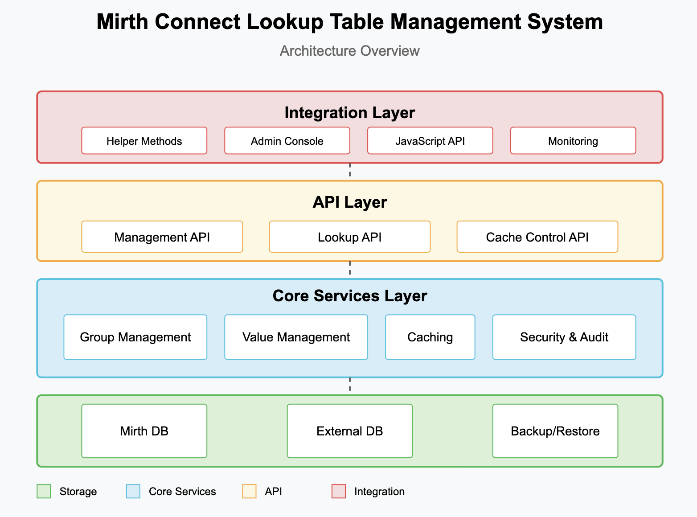

## Lookup Table Management System - Use Case Matrix

| Use Case           | Administrator | Channel            | External System |
|--------------------|---------------|--------------------|-----------------|
| Manage Groups      | ✓             |                    |                 |
| Manage Values      | ✓             |                    |                 |
| View Statistics    | ✓             |                    |                 |
| View Audit Trail   | ✓             |                    |                 |
| Import/Export      | ✓             |                    |                 |
| Create Group       | ✓             | ✓                  |                 |
| Delete Group       | ✓             | ✓                  |                 |
| Insert Value       | ✓             | ✓                  |                 |
| Update Value       | ✓             | ✓                  |                 |
| Delete Value       | ✓             | ✓                  |                 |
| Lookup Value       | ✓             | ✓                  |                 |
| Check Existence    | ✓             | ✓                  |                 |
| Batch Lookup       | ✓             | ✓                  |                 |
| Pattern Match      | ✓             | ✓                  |                 |
| Get Cache Stats    | ✓             | ✓                  |                 |
| Validate Key       | ✓             | ✓                  |                 |
| Cache Access       |               | ✓                  |                 |
| Record Audit       |               | ✓                  |                 |
| API Lookup         |               |                    | ✓               |
| API Management     |               |                    | ✓               |
| Get Statistics     |               |                    | ✓               |
| Authenticate       |               |                    | ✓               |

## External Database Usage
An external database can be used with the Dynamic Lookup Gateway. 
A properties file is located at `{blDirectory}/conf/dynamic-lookup.properties`

### Enable external database for DLG:
Set to true if an external database should be used instead of the default Mirth Connect internal database connection.
```
# If true, the plugin will use an external database defined below.
# If false, it will reuse Mirth Connect's internal database connection.
useExternalDb=true
```

### Set database type:
Specifies the type of database being used. Supported options include:
* derby
* mysql
* postgres
* oracle
* Sqlserver
```
# options: derby, mysql, postgres, oracle, sqlserver
database = postgres
```

### Database Connection URL
Define the JDBC URL connection string for your database type.
```
# examples:
#   Derby                     		  jdbc:derby:${dir.appdata}/mirthdb;create=true
#   PostgreSQL                 		  jdbc:postgresql://localhost:5432/mirthdb
#   MySQL                       		  jdbc:mysql://localhost:3306/mirthdb
#   Oracle                      		  jdbc:oracle:thin:@localhost:1521:DB
#   SQL Server/Sybase (jTDS)    	  jdbc:jtds:sqlserver://localhost:1433/mirthdb
#   Microsoft SQL Server        	  jdbc:sqlserver://localhost:1433;databaseName=mirthdb
#   If you are using the Microsoft SQL Server driver, please also specify database.driver below


database.url = jdbc:postgresql://localhost:5432/dynamiclookup
```

### Database Driver 
Use this setting if a custom driver is required (e.g., Microsoft’s official SQL Server driver instead of the default jTDS).
```
# If using a custom or non-default driver, specify it here.
# example:
# Microsoft SQL Server: database.driver = com.microsoft.sqlserver.jdbc.SQLServerDriver
# (Note: the jTDS driver is used by default for sqlserver)
#database.driver =
```

### Connection Pooling
Set the maximum number of simultaneous database connections for performance optimization.
```
# Maximum number of connections allowed for the main read/write connection pool
database.max-connections = 20
```

### Authentication Credentials
Provide the username and password for authenticating with the database.
```
# database credentials
database.username = dbusername
database.password = dbpassword
```

### Connection Retry Settings
Set the number of retry attempts to establish a connection during startup if the initial connection fails.
```
# On startup, Maximum number of retries to establish database connections in case of failure
database.connection.maxretry = 2
```

# Features and Capabilities

## Lookup Group Management

* Create, edit, and delete groups
* Assign descriptions, cache settings, and access scope
* Maintain metadata like version, timestamps, and last accessed
* Batch import/export via JSON

## Value Management

* Add/edit/delete key-value pairs
* Batch import/export via CSV
* Unique key validation per group
* Audit trail of changes and optional timestamps
* Filter and search capabilities for large datasets

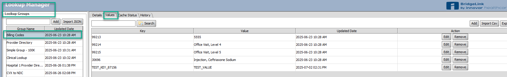

## Caching

* Manual and automatic cache refresh
* TTL, eviction policy (FIFO, LRU), and entry limits
* Hit/miss tracking and performance stats

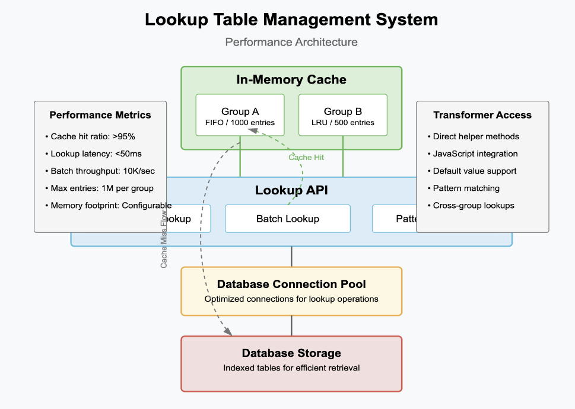

## Storage Configuration

* Default to MirthDB for lookup storage
* Support for external DBs
* Supports backup/restore, failover, and connection pooling

## Access Control

* Role-based access using BridgeLink RBAC
* Audit logging for changes and access

## Transformer Integration

* Use helper methods inside channel scripts
* Support for default values, matching, partials, and cross-group queries

***Example:***

Lookup Helper GET will search for code "99213". If key does not exist it will return the TTLHours Variable

```javascript
// Test LookupHelper.get (with TTL)
var ttlHours = 24*20;
var ttlValue = LookupHelper.get("Billing Codes", "99213", ttlHours);
logger.info("ttlValue (within TTL): " + ttlValue);
```


# How to Use Dynamic Lookup Gateway

## Step-by-Step: Create a New Lookup Table

Log in to BridgeLink
Navigate to the Left Sidebar under Data Store and click "Lookup Manager"
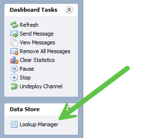

Under "Lookup Group" click "Add" or "Import JSON".

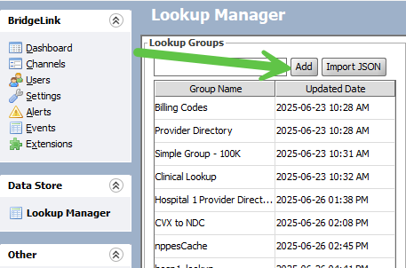

Enter a name and optional description, then click Save.

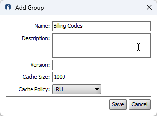

The Group is now Created.

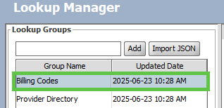

Next:

* Import your key and value entries into the target group.
* Click the Lookup Group you just created
* Select Import CSV
* Choose a file with headers: Key, Value

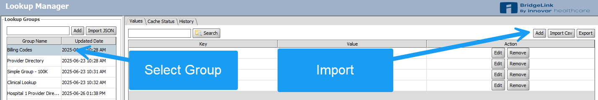

Open CSV

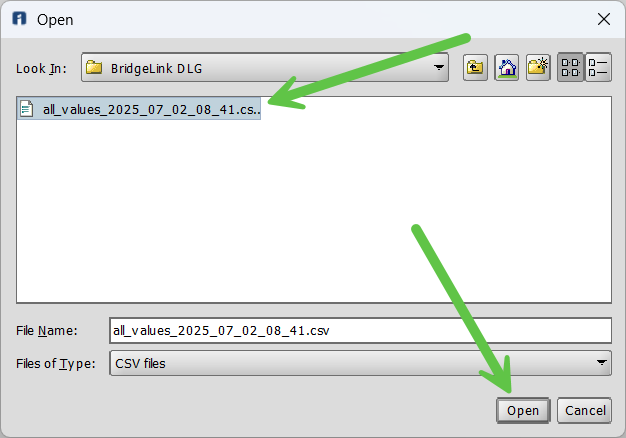

Upon success, your values will appear in the editable grid below.

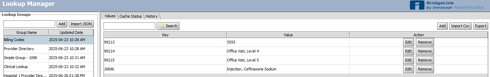

## Monitor/Managing Cache

The Cache Status tab provides real-time visibility into the performance of each lookup group. It tracks lookup activity, cache hit and miss rates, and overall memory usage to ensure values are being served efficiently from memory. This view is essential for confirming that look-up data has been properly loaded and that the system is delivering quick responses from cache.

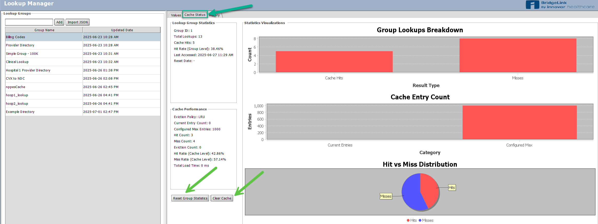

* Click the Cache Status tab to view group-specific stats, cache configuration, and performance graphs.
* Select Target Group.
* Use "Reset Group Statistics" to clear hit/miss data and timestamps
* Use "Clear Cache" to remove all current entries

## Accessing the Client API

BridgeLink provides a built-in Client API interface for interacting with system resources via REST. Users can view available endpoints, test requests, and access real-time system operations directly through a browser.

### How to Open the API Interface

You can access the API in two ways:

* From the Admin Console: Navigate to the "Other" section in the left-hand menu and click View Client API.
* Direct URL: Enter the following in your browser, replacing the IP address with your system's value:
`https://<your-server-ip>:8443/api`

This opens the Client API interface where you can browse, test, and execute endpoint calls directly.

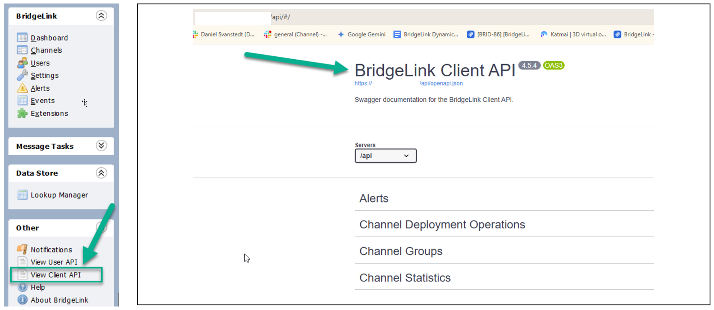

### Accessing API Samples and Testing Requests

The BridgeLink Client API includes prebuilt sample calls grouped by category, such as channel operations, system statistics, and lookup tables. Each API section lists available endpoints, along with methods like `GET`, `POST`, `PUT`, and `DELETE`, and includes a short description of the request behavior.

In the Lookup Table section, for example, you'll find endpoints for:

* Viewing all lookup groups
* Creating or updating a group
* Clearing caches
* Fetching audit history
* Deleting groups by ID
* These samples are available to help you learn what data each call expects and returns.
* To explore these samples:
* Navigate to the desired API section (e.g., Lookup Table).
* Click the dropdown arrow to expand the list of available endpoints.
* Review the descriptions for each method to understand what it does.


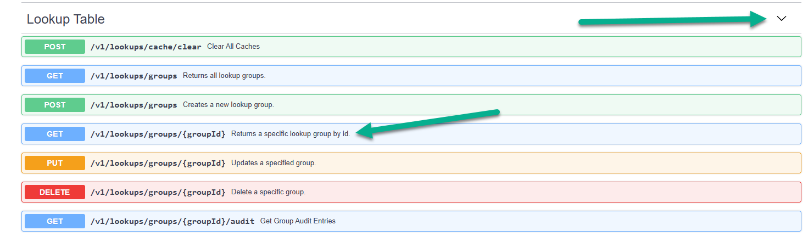


Next, we'll walk through how to test these endpoints using the built-in Try It Out feature.


From the list of available APIs, find the `GET /v1/lookups/groups/{groupId}` endpoint. This allows you to retrieve a specific lookup group by its ID.

Click the endpoint to expand its details.

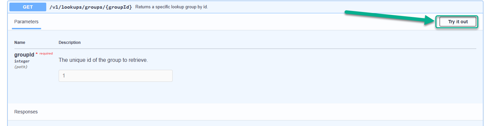

Enter a valid group ID in the provided field. For example: we entered "1" for our table demo.

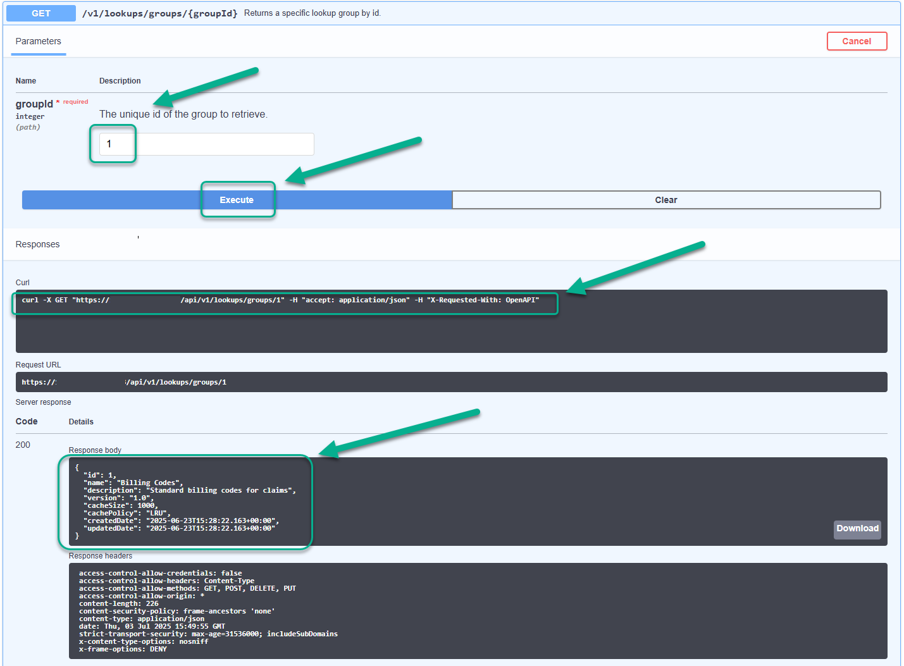

Click Execute to run the request. The response section will populate below with details including:

* Curl request for reference
* Request URL
* Response body (with JSON structure)
* HTTP status code and response headers

This feature is helpful for validating API behavior directly within the browser - no external tools required.


## DLG Group-Level Operations
* `GET /v1/lookups/groups` – Returns all lookup groups
* `POST /v1/lookups/groups` – Creates a new group
* `GET /v1/lookups/groups/{groupId}` – Returns a specific group
* `PUT /v1/lookups/groups/{groupId}` – Updates a group
* `DELETE /v1/lookups/groups/{groupId}` – Deletes a group
* `GET /v1/lookups/groups/{groupId}/audit` – Gets audit entries
* `POST /v1/lookups/groups/{groupId}/audit/search` – Searches audit entries
* `POST /v1/lookups/groups/{groupId}/cache/clear` – Clears cache for a group
* `GET /v1/lookups/groups/{groupId}/export` – Exports group and values
* `GET /v1/lookups/groups/{groupId}/exportPaged` – Export in pages
* `GET /v1/lookups/groups/{groupId}/statistics` – View usage stats
* `POST /v1/lookups/groups/{groupId}/statistics/reset` – Reset stats

## DLG Key & Value-Level Operations
* `GET /v1/lookups/groups/{groupId}/values` – Get all values for group
* `POST /v1/lookups/groups/{groupId}/values` – Import key-value pairs
* `GET /v1/lookups/groups/{groupId}/values/{key}` – Get a single value
* `PUT /v1/lookups/groups/{groupId}/values/{key}` – Set/update a value
* `DELETE /v1/lookups/groups/{groupId}/values/{key}` – Delete a value
* `POST /v1/lookups/groups/{groupId}/batch` – Batch set values

## Imports & Named Lookups
* `POST /v1/lookups/groups/import` – Import a full group
* `GET /v1/lookups/groups/name/{name}` – Get group by name

# Provider Directory Lookup in Action
This example demonstrates how BridgeLink uses the Dynamic Lookup Gateway (DLG) to enrich HL7 messages by dynamically mapping provider codes to structured metadata. In this walkthrough, we transform a basic ADT message by using the DLG to populate full provider details based on internal codes.


## Source HL7 Input Message
The first screenshot shows the unmodified ADT^A01 message received from the source system. Note the PV1-7 field (Attending Provider), which contains internal or shorthand provider codes like: `JDOE^SMITH^RJOHNSON`

These are not structured HL7 provider fields and lack details like NPI, first name, or proper formatting.

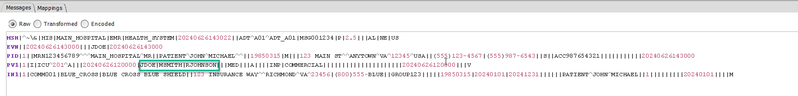

## Transformed HL7 Message Output

In the second screenshot, the message has been enriched using data returned from the DLG. The PV1-7 field has been updated with fully structured provider names and NPIs:

`Doe^John^1987654321~Smith^Mary^1122334455~Johnson^Robert^5566778899`


Each internal code was matched against a lookup entry and replaced with the correct NPI and name details.

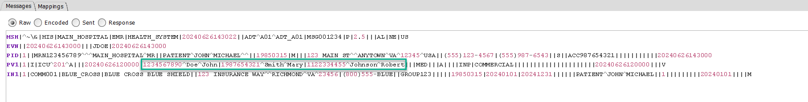

## Lookup Manager Interface

The third screenshot shows the DLG Lookup Manager interface, where provider directory mappings are stored. This example uses a group named "Hospital 1 Provider Directory."


Each key (e.g., JDOE, MSMITH, RJOHNSON) returns a structured JSON value containing:

```json
{
"npi": "1987654321",
"first_name": "Mary",
"last_name": "Smith"
}
```

The UI allows for easy management, bulk updates, search, and real-time caching of these values; eliminating the need to hardcode them in channel scripts.

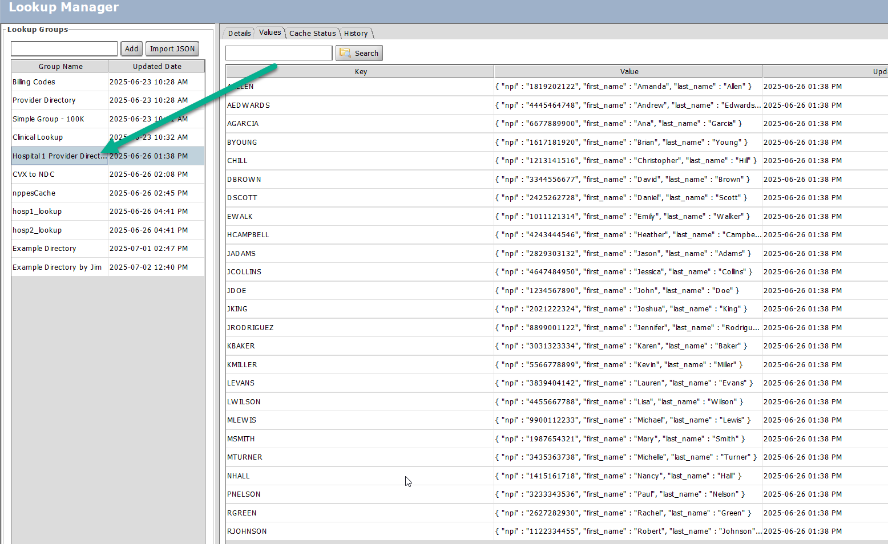


## Transformation Example

The final screenshot shows how BridgeLink uses the Dynamic Lookup Gateway (DLG) within a transformation script to enrich HL7 messages at runtime.


In this example, the script pulls internal provider codes from the PV1 segment (fields PV1.7, PV1.8.1, and PV1.9.1) and uses the `LookupHelper.get()` method to query the DLG group named "Hospital 1 Provider Directory".

For each code found, the DLG returns a JSON object containing the provider's full name and NPI. These values are parsed and reassigned back to the original HL7 fields in a structured format, ensuring downstream systems receive complete, standardized provider data.


This method allows organizations to maintain a centralized, editable provider directory in the DLG UI while keeping channel logic lightweight and reusable.


Example script behavior:

* Extract internal code from the HL7 field
* Perform a DLG lookup using the configured group
* Parse the returned JSON (containing NPI, last name, first name)
* Reassign the HL7 segment with the new structured provider data

This eliminates the need to hardcode provider metadata inside channel scripts and enables dynamic updates without redeploying channels.


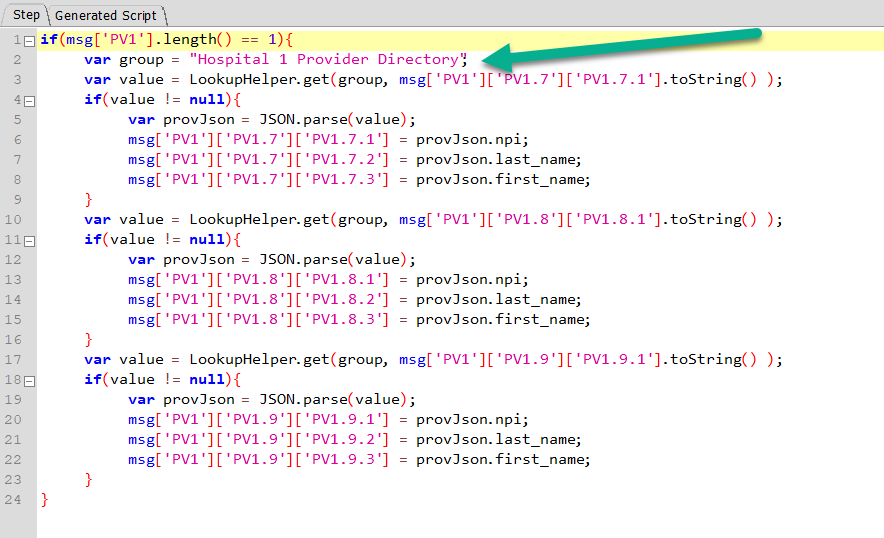

## Lookup Helper Functions Overview

BridgeLink includes a built-in scripting reference pane that displays all available LookupHelper methods. Users can simply drag the panel into view to access a categorized list of function calls for quick reference and use.

Each function can be dragged directly into the script editor to speed up development and reduce errors.

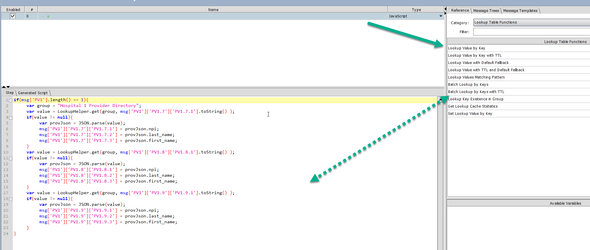
